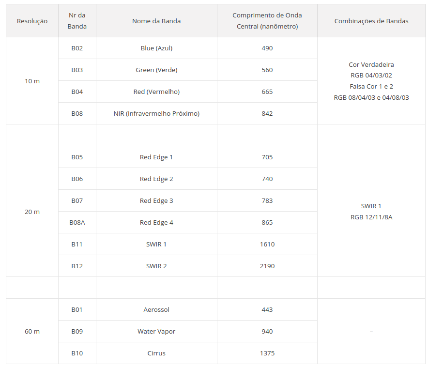

# Dataset - Utilidades

```
├── OSCD
|  ├── abdudhabi
|  ├── aguasclaras
|  ├── beihai
|  ├── beirut
|  ├── bercy
|  ├── bordeaux
|  ├── brasilia
|  ├── chongqing
|  ├── cupertino
|  ├── dubai
|  ├── hongkong
|  ├── lasvegas
|  ├── milano
|  ├── montpellier
|  ├── mumbai
|  ├── nantes
|  ├── norcia
|  ├── paris
|  ├── pisa
|  ├── rennes
|  ├── rio
|  ├── saclay_e
|  ├── saclay_w
|  ├── valencia
|  ├── all.txt
|  ├── README.txt
|  ├── test.txt
|  ├── train.txt

```

```
├── OSCD
|  ├── abdudhabi
|  |  ├── cm
|  |  |   ├── abdudhabi-cm.tif
|  |  |   ├── cm.png
|  |  ├── imgs_1
|  |  |   ├── S2A_OPER_MSI_L1C_TL_MTI__20160120T104345_A003020_T39QZG_B01.tif
|  |  |   ├── S2A_OPER_MSI_L1C_TL_MTI__20160120T104345_A003020_T39QZG_B02.tif
|  |  |   ├── S2A_OPER_MSI_L1C_TL_MTI__20160120T104345_A003020_T39QZG_B03.tif
|  |  |   ├── S2A_OPER_MSI_L1C_TL_MTI__20160120T104345_A003020_T39QZG_B04.tif
|  |  |   ├── S2A_OPER_MSI_L1C_TL_MTI__20160120T104345_A003020_T39QZG_B05.tif
|  |  |   ├── S2A_OPER_MSI_L1C_TL_MTI__20160120T104345_A003020_T39QZG_B06.tif
|  |  |   ├── S2A_OPER_MSI_L1C_TL_MTI__20160120T104345_A003020_T39QZG_B07.tif
|  |  |   ├── S2A_OPER_MSI_L1C_TL_MTI__20160120T104345_A003020_T39QZG_B08.tif
|  |  |   ├── S2A_OPER_MSI_L1C_TL_MTI__20160120T104345_A003020_T39QZG_B8A.tif
|  |  |   ├── S2A_OPER_MSI_L1C_TL_MTI__20160120T104345_A003020_T39QZG_B09.tif
|  |  |   ├── S2A_OPER_MSI_L1C_TL_MTI__20160120T104345_A003020_T39QZG_B010.tif
|  |  |   ├── S2A_OPER_MSI_L1C_TL_MTI__20160120T104345_A003020_T39QZG_B011.tif
|  |  |   ├── S2A_OPER_MSI_L1C_TL_MTI__20160120T104345_A003020_T39QZG_B012.tif
|  |  ├── imgs_1_rect
|  |  |   ├── B01.tif
|  |  |   ├── B02.tif
|  |  |   ├── B03.tif
|  |  |   ├── B04.tif
|  |  |   ├── B05.tif
|  |  |   ├── B06.tif
|  |  |   ├── B07.tif
|  |  |   ├── B08.tif
|  |  |   ├── B8A.tif
|  |  |   ├── B09.tif
|  |  |   ├── B010.tif
|  |  |   ├── B011.tif
|  |  |   ├── B012.tif
|  |  ├── imgs_2
|  |  ├── imgs_2_rect
|  |  ├── pair
|  |  |   ├── img1.png
|  |  |   ├── img2.png
|  |  ├── abudhabi.geojson
|  |  ├── dates.txt
```

## TIF - *Tagged Image File*

O [TIFF](https://pt.wikipedia.org/wiki/Tagged_Image_File_Format) (*Tagged Image File Format*) é um formato de arquivo *raster* (bitmap, pixel, gráfico vetorial) para imagens digitais. Foi criado pela Aldus para uso no processo de impressão PostScript, porém agora é controlado pela Adobe. Transformou-se no formato padrão dos arquivos gráficos (32-bits) com elevada definição de cores (TIF pode conter profundidade de cor de até 32 bits por canal).

É usado extensamente em aplicações de manipulação de imagem tais como Photoshop, DTP e scanners e também muito utilizado para o intercâmbio de imagens entre as diversas plataformas (hardware: PC, Macintosh, software: Linux, Windows). Há ainda a opção na qual um arquivo **.tif** ou **.tiff** tenha mais de uma página dentro de um único arquivo. Como um TIF permite o armazenamento sem perdas de uma imagem, é particularmente útil para o pós-processamento com software profissional.

O [princípio do formato TIFF](https://br.ccm.net/contents/725-o-formato-tif-ou-tiff) consiste em definir tags que descrevem as características da imagem. Elas permitem armazenar informações relativas às dimensões da imagem, número de cores utilizadas, tipo de compressão (numerosos algoritmos podem ser utilizados) e correção da gama.

Assim, a descrição da imagem por tags confere simplicidade à programação de um software, já que permite registrá-lo no formato TIFF. Por outro lado, a multiplicidade de opções propostas é tal que muitos leitores de imagens que suportam o formato TIFF não as integram completamente. É por esta razão que uma imagem registrada no formato TIFF pode não ser lida por alguns leitores.

Na descrição das pastas acima, os arquivos TIF contém as imagens referentes a cada banda (13 no total).

## Para Pesquisar

- [QGIS 3: Composição Colorida RGB para imagens Sentinel-2](https://www.youtube.com/watch?v=0r6KFfZvcjg) - como juntar as bandas TIF da imagem de satélite e criar uma imagem TIF ou PNG;
- Baixar imagens de satélite: https://search.remotepixel.ca/#3/40/-70.5
- [Composição RGB](https://www.instrutorgis.com.br/gdal-processamento-de-imagens-sentinel2_p01/);
- [Composição - formando uma imagem colorida](https://www.instrutorgis.com.br/qgis3-composicao-colorida-rgb-sentinel2/);

## Bandas das Imagens Sentinel-2



### Bandas/Imagens Multiespectrais

- https://www.santiagoecintra.com.br/blog/geo-tecnologias/o-que-sao-os-sensores-multiespectraisy
- https://xmobots.com.br/cameras-multiespectrais-no-sensoriamento-remoto-e-hora-de-rever-seus-conceitos/
- https://forest-gis.com/2019/12/sentinel-2-combinacao-bandas-baixar-dados.html/

O Sentinel-2 tem 13 bandas espectrais, que vão do visível e do infra-vermelho próximo, até infra-vermelho de ondas curtas, em diferentes resoluções espaciais.

Resolução espacial de cada banda ([level-2A](https://sentinel.esa.int/web/sentinel/user-guides/sentinel-2-msi/processing-levels/level-2)):

- **10m**: bandas espectrais 2, 3, 4, 8, uma imagen *True Color Image* (**TCI**) e mapas **AOT** (*Aerosol Optical Thickness) e **WV** (*Water Vapour*) reamostrados a partir de 20m;
- **20m**: contém bandas espectrais 2-7, as bandas 8A, 11 e 12, uma TCI, um mapa de classificação de cenas (**SCL**) e um mapa AOT e WV. A banda B8 é omitida, pois a B8A fornece informações espectrais mais precisas;
- **60m**: contém todos os componentes do produto de 20m reamostrados para 60m e adicionalmente as bandas 1 e 9. A banda de cirro (nuvem) 10 é omitida, pois não contém informações de superfície;

### Combinações de Bandas Sentinel-2 para cada utilidade

- Cores naturais: 4-3-2
- Cor falsa Infravermelho: 8-4-3
- Cor falsa Urbana: 12-11-4
- Agricultura: 11-8-2
- Penetração atmosférica: 12-11-8a
- Vegetação saudável: 8-11-2
- Terra / Água: 8-11-4
- Cores naturais com remoção atmosférica: 12-8-3
- Infravermelho de ondas curtas: 12-8-4
- Análise da vegetação: 11-8-4